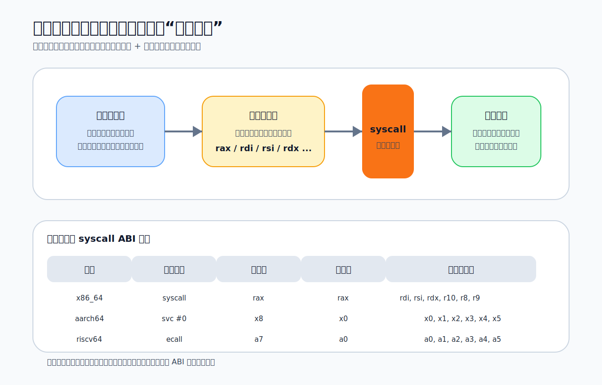
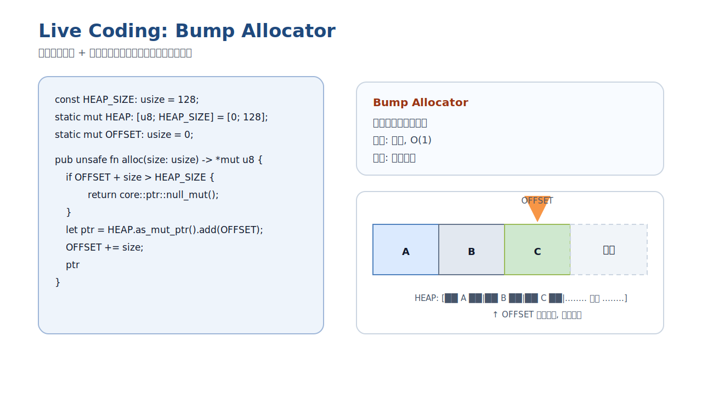
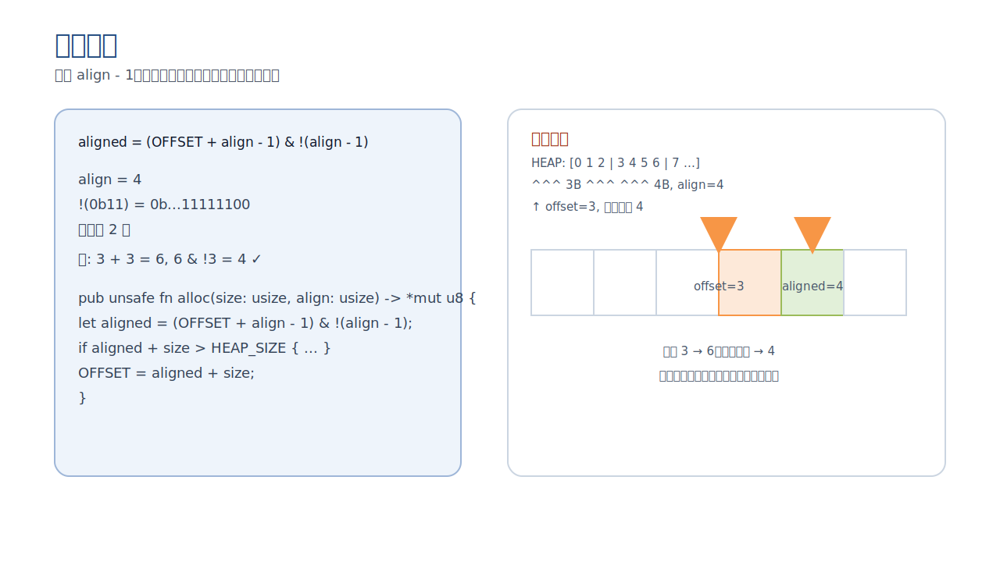
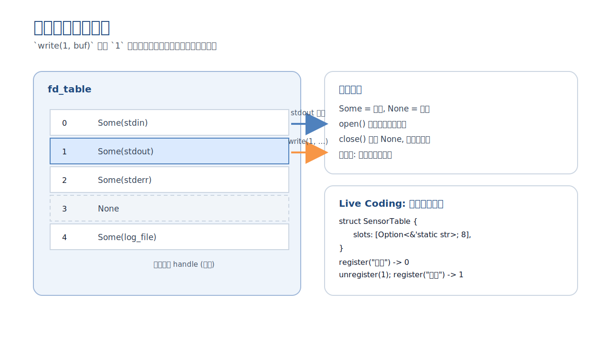

# 从 Hello World 到 syscall：为什么 Rust 的 `no_std` 是操作系统开发的第一道门

## 引言

很多人第一次接触 Rust 的 `no_std`，会把它理解成一句很简单的话：**不使用标准库**。

这句话当然没错，但如果只停留在这个层面，就很难真正理解 `no_std` 在操作系统开发里的意义。对内核、Bootloader、固件或者裸机程序来说，`no_std` 从来不只是“少了一个库”，而是意味着一整套默认前提的消失：

- 没有现成的运行时入口
- 没有默认的 panic 处理
- 没有现成的堆分配器
- 没有 `println!`
- 没有线程、文件、网络这些熟悉的 OS 抽象

换句话说，平时应用程序默认拥有的一切，在这里都要重新审视。也正因如此，`no_std` 才会成为 Rust 系统编程里的第一道门槛。

本文尝试从一个更接近系统实现的角度来理解 `no_std`：从一个普通的 `println!` 出发，一路往下追到 `syscall`、内核、堆分配器和资源管理模型，看看一个“最小可运行程序”到底需要哪些支撑，以及为什么这些事情最终会把我们带到操作系统的核心问题上。

---

## 一个 `println!` 背后，远不止一次输出

在用户态 Rust 程序里，下面这段代码实在太普通了：

```rust
fn main() {
    println!("hello");
}
```

但如果真的去追问“它是怎么把字符串打印到终端上的”，就会发现中间隔着很多层抽象。

从调用链看，大致是这样一条路径：

```text
println!()
  -> std::io::Write
  -> libc::write
  -> syscall(SYS_write, ...)
  -> 内核 sys_write
  -> fd_table[1]
  -> 终端设备驱动
```

在应用开发里，这些细节大多被 `std` 和 libc 屏蔽掉了，所以我们几乎不会主动去想：输出到终端这件事，为什么最终会变成一个系统调用？为什么 `1` 代表标准输出？为什么字符串写出去之前还要经历一次用户态到内核态的切换？

而 `no_std` 的价值，恰恰就在于它逼着你直面这些问题。它会把那层熟悉的封装撕开，让你重新看到程序和操作系统之间真正的边界。


如果按课件里的实验先跑一遍 `strace ./hello 2>&1 | wc -l`，你会更直观看到：普通 `println!` 版本会带出一串初始化和收尾 syscall，而 `no_std` 版本把路径压缩到极少数必要调用时，程序边界一下子就清楚了。


---

## `no_std` 到底去掉了什么

Rust 的库大致可以分成三层：

- `core`：零依赖的语言核心能力
- `alloc`：依赖分配器的动态内存能力
- `std`：依赖操作系统的完整标准库

这三层关系很重要，因为它直接决定了 `no_std` 的真实含义。

### `core`

`core` 里已经有很多 Rust 最重要的基础设施：

- `Option`、`Result`
- trait 和泛型
- slice、str
- 原子操作
- `fmt` 格式化框架

它不依赖操作系统，因此天然适合最底层环境。

### `alloc`

`alloc` 提供的是动态内存相关的能力，例如：

- `Vec`
- `Box`
- `String`
- `Arc`

但它有一个前提：你必须先提供全局分配器。

### `std`

`std` 则进一步建立在 `core + alloc + OS 支持` 之上，里面才有：

- 文件系统
- 网络
- 线程
- 时间
- 标准输入输出

所以：

```rust
#![no_std]
```

真正的含义不是“什么都不能用了”，而是：**程序不再链接 `std`，因此不能再默认依赖操作系统提供的完整运行环境。**

这也是为什么很多初学者容易误解：

- `no_std` 不等于不能使用 Rust 语言本身
- `no_std` 不等于完全不能动态分配
- `no_std` 只是意味着这些能力不会再被自动准备好

![Rust 三层库关系与 `#![no_std]` 的影响](images/no_std_article/02-rust-lib-stack.svg)

---

## 从空文件到最小 `no_std` 程序

最能体现 `no_std` 本质的，不是概念解释，而是一个最小示例。

```rust
#![no_std]
#![no_main]

use core::panic::PanicInfo;

#[panic_handler]
fn panic(_: &PanicInfo) -> ! {
    loop {}
}

#[no_mangle]
pub extern "C" fn _start() -> ! {
    loop {}
}
```

如果你是在 Linux 用户态里复现这个最小示例，通常还需要关掉默认启动文件，比如 `-nostartfiles` 或 `-C link-args=-nostartfiles`，否则链接器仍然会塞入 CRT 启动代码。

这个程序几乎什么都没做，但它已经暴露出 `no_std` 下最核心的几个变化。

### 1. 没有默认的 `main`

平时写 Rust 程序时，我们只需要写一个 `main`，剩下的启动流程都由运行时处理。但进入 `no_std` 之后，这套默认启动逻辑不再存在，于是你必须自己提供入口点，例如 `_start`。

### 2. 没有默认的 panic 行为

标准库会帮你处理 panic 的打印、展开、退出等流程；而 `no_std` 下，这一切都不再自动存在，所以必须自己实现 `#[panic_handler]`。

### 3. 程序从“业务逻辑”退回到了“运行时搭建”

最重要的变化其实不是语法，而是思维方式。你不再只是“写程序逻辑”，而是在补一套最小运行时。这也是为什么很多人第一次写 `no_std` 程序时，会感觉它更像在写系统，而不是在写应用。

---

## 系统调用：用户态和内核态之间唯一合法的门

一旦没有了 `println!`，最自然的问题就是：那我怎样把字符串输出到终端？

答案是，直接调用系统调用。

系统调用是用户态程序向内核请求服务的标准方式。用户程序不能直接访问硬件，也不能直接操作内核对象，所以它必须通过约定好的 ABI，把参数放到指定寄存器中，再执行特定指令，由 CPU 完成一次特权级切换，让内核来接管执行。

不同架构的 syscall 约定并不完全相同：

| 架构 | 触发指令 | 调用号寄存器 | 返回值寄存器 | 参数寄存器 |
|---|---|---|---|---|
| `x86_64` | `syscall` | `rax` | `rax` | `rdi, rsi, rdx, r10, r8, r9` |
| `aarch64` | `svc #0` | `x8` | `x0` | `x0, x1, x2, x3, x4, x5` |
| `riscv64` | `ecall` | `a7` | `a0` | `a0, a1, a2, a3, a4, a5` |

其中，`x86_64` 还要额外注意 `rcx` 和 `r11` 会被硬件改写，因此在内联汇编里必须显式声明。

这张表其实已经说明了很多事情：

- 系统调用本质上是寄存器协议
- 用户态和内核态的交互是高度架构相关的
- “系统接口”并不是一个抽象概念，而是一套可以落到寄存器和指令级别的具体约定



---

## 用 `asm!` 手写一个最小版 Hello

如果我们完全绕开 `std` 和 libc，直接在 `no_std` 程序里发起 `write`，代码会长得非常底层：

```rust
#[no_mangle]
pub extern "C" fn _start() -> ! {
    let msg = b"Hello, OS!\n";
    unsafe {
        core::arch::asm!(
            "syscall",
            in("rax") 1usize,        // SYS_write
            in("rdi") 1usize,        // stdout
            in("rsi") msg.as_ptr(),
            in("rdx") msg.len(),
            out("rcx") _,
            out("r11") _,
        );

        core::arch::asm!(
            "syscall",
            in("rax") 60usize,       // SYS_exit
            in("rdi") 0usize,
            options(noreturn),
        );
    }
}
```

这段代码很粗糙，却也很有教育意义。因为它把“输出一行文本”这件事还原成了最原始的形态：

- `rax = 1` 表示 `write`
- `rdi = 1` 表示向 `stdout` 写
- `rsi` 是缓冲区地址
- `rdx` 是长度

此时你看到的已经不是“打印字符串”，而是“按 syscall ABI 向内核请求一次写操作”。

这一步非常关键。因为从这里开始，我们才真正接触到系统编程的核心现实：用户程序表面上的高级操作，最终都会被压缩成很少几条极底层的接口调用。

---

## 从裸汇编到 `syscall3`：抽象开始出现

直接写汇编虽然直观，但显然不适合作为长期接口。于是一个自然的重构就是：把这类系统调用封装成统一函数。

例如：

```rust
unsafe fn syscall3(
    id: usize,
    arg0: usize,
    arg1: usize,
    arg2: usize,
) -> isize {
    let ret: isize;
    core::arch::asm!(
        "syscall",
        inlateout("rax") id => ret,
        in("rdi") arg0,
        in("rsi") arg1,
        in("rdx") arg2,
        out("rcx") _,
        out("r11") _,
    );
    ret
}
```

再往上包一层，就能得到更有语义的接口：

```rust
fn sys_write(fd: usize, buf: &[u8]) -> isize {
    unsafe { syscall3(1, fd, buf.as_ptr() as usize, buf.len()) }
}

fn sys_exit(code: usize) -> ! {
    unsafe { syscall3(60, code, 0, 0); }
    loop {}
}
```

这一步看似只是“代码整理”，其实非常像系统软件里的真实分层：

- 最底层是指令和 ABI
- 往上一层是 syscall wrapper
- 再往上才是更稳定、更语义化的系统接口

也就是说，我们已经开始从“直接和硬件协议打交道”过渡到“自己设计抽象层”。这恰恰就是操作系统实现的常见模式。


---

## 为什么 `no_std` 很快就会引出分配器

一旦把 `std` 拿掉，很多平时习以为常的能力都会暴露出前提条件，堆分配就是其中最典型的一个。

在应用程序里，像 `String`、`Vec`、`format!` 这类东西看起来很自然；但在系统编程里，它们背后都隐含着一个问题：**内存是从哪来的？**

标准库时代，这个问题通常由底层 allocator 帮你处理；而 `no_std` 环境下，分配器本身往往还不存在。于是问题立刻反转：

不是“我如何使用内存分配器”，而是“我如何先造出一个内存分配器”。

这也是操作系统开发里非常典型的“自举”问题。参考内核开发的讨论可以发现，内存管理往往必须从一个极小、极朴素的 early allocator 起步，然后再逐步进化到更完整的分配框架。

---

## Bump Allocator：最简单，也最诚实

在所有 allocator 里，最适合用来理解问题本质的，是 Bump Allocator。

它的逻辑极其简单：

1. 准备一段连续内存
2. 维护一个偏移量
3. 每次分配时从当前偏移继续切一块
4. 偏移向前移动

示意代码如下：

```rust
const HEAP_SIZE: usize = 128;
static mut HEAP: [u8; HEAP_SIZE] = [0; 128];
static mut OFFSET: usize = 0;

pub unsafe fn alloc(size: usize) -> *mut u8 {
    if OFFSET + size > HEAP_SIZE {
        return core::ptr::null_mut();
    }
    let ptr = HEAP.as_mut_ptr().add(OFFSET);
    OFFSET += size;
    ptr
}
```



它的优点非常明显：

- 实现简单
- 分配速度快
- 非常适合启动阶段和短生命周期对象

但它的问题同样直接：

- 不能释放
- 无法复用中间空洞

也就是说，Bump Allocator 之所以经典，不是因为它足够强，而是因为它把“分配器到底在做什么”解释得足够清楚。它让我们意识到：堆分配器首先不是一个复杂黑盒，而只是“管理一块内存并决定下一块怎么切”。

---

## 对齐：分配器第一次真正面对硬件约束

当 allocator 再往前走一步，就会遇到一个无法回避的问题：**内存对齐**。

很多对象并不是“随便给个地址就能放”。例如某些类型要求 4 字节、8 字节甚至更高的对齐边界。如果地址不满足要求，轻则性能下降，重则行为未定义或直接异常。

因此分配器往往需要先做“向上对齐”：

```rust
let aligned = (offset + align - 1) & !(align - 1);
```



这行代码表面上只是位运算，实际上却标志着系统编程的一种典型变化：代码不再只是满足语言层面的正确性，而要开始满足 ABI 和硬件层面的正确性。

也正是在这些地方，`no_std` 的学习价值会越来越明显。因为标准库平时帮你挡住了这些问题，而系统开发必须正面处理它们。

---

## 如果还想 `free`：从 Bump 走向 Free List

Bump Allocator 有一个很致命的限制：它只会往前走，不会回头。

假设我们依次分配了 A、B、C，然后释放 B。对于 bump 来说，这块中间空洞几乎等于“丢了”，因为它没有机制知道该如何复用它。

这就引出了更进一步的设计：Free-List Allocator。

它的基本思想是：

- 被释放的块进入空闲链表
- 新的分配请求先在空闲链表中查找
- 如果能找到合适块，就优先复用

进一步还可以使用侵入式链表，把元数据直接存在空闲块本身里面，避免额外开销。

从教学角度看，这一步非常重要。因为它让分配器不再只是“不断向前切块”，而是开始具备了真正的资源管理能力。系统编程中的很多抽象，都是从这种“先能工作，再能复用，再能管理”的过程里长出来的。


---

## `fd_table`：为什么 `write(1, ...)` 里的 `1` 如此重要

理解了系统调用和分配器之后，另一个很自然的问题是：为什么 `write(1, buf, len)` 里的参数是 `1`？

这个 `1` 当然不是魔法数字。它代表的是一个文件描述符，也就是用户态程序持有的资源凭证。

在内核里，它通常会对应到某种句柄表结构：

```text
0 -> stdin
1 -> stdout
2 -> stderr
3 -> None
4 -> log_file
...
```

于是，`write(1, ...)` 的真实含义就变成了：

1. 用户程序拿着句柄 `1`
2. 内核在 `fd_table` 里查到它对应的是 `stdout`
3. 然后把写请求转交给对应的设备或文件对象

这个模型非常基础，但也非常普遍。因为它揭示了一个内核设计中的重要原则：

**用户态通常不直接操作资源对象，而是通过“整数句柄 -> 内核对象”的间接映射来管理资源。**



---

## Handle Table：资源管理的通用模式

如果把文件描述符抽象掉，就会发现它其实只是一个更一般模型的实例：

- 表的索引就是句柄
- 表项要么被占用，要么为空
- 分配资源时返回一个最小可用索引
- 释放资源时把对应位置重新标记为空

这就是 Handle Table。

无论是：

- 文件描述符表
- 传感器注册表
- 设备句柄表
- 进程或线程对象引用

它们底层都常常能回到类似模式。

课件里用 `Vec<Option<Arc<dyn File>>>` 作为练习要求，其实设计得很巧妙：

- `Vec` 负责动态扩展
- `Option` 表示槽位是否为空
- `Arc<dyn File>` 同时承载多态和共享所有权

这意味着你不仅要理解句柄表本身，还要把 allocator、trait object 和引用计数这些知识一起串起来。到这里，`no_std` 已经不再是一个单独话题，而开始变成一整套系统抽象的入口。

---

## 从 `no_std` 回到内核：它真正训练的是什么

如果只把 `no_std` 当作 Rust 的一个编译开关，理解一定会非常浅。更准确地说，`no_std` 真正在训练的，是一种面向“系统尚未建立完成”的开发思维。

这背后至少有三层含义。

### 1. 训练自组织能力

在应用程序里，运行时、堆、I/O、线程、文件系统都是现成的；但在内核和裸机场景里，这些能力本身就是待实现对象。你必须自己定义入口、自己处理 panic、自己实现 allocator、自己建立资源管理结构。

### 2. 训练分层意识

从 `asm!` 到 `syscall3`，从 `fd` 到 `fd_table`，从一块静态内存到 allocator，这些内容本质上都在讲同一件事：复杂系统必须通过分层抽象来搭建，而这些抽象不是凭空存在的，它们都可以一路追到非常底层的实现细节。

### 3. 训练对“隐藏成本”的敏感度

用户态程序里那些看起来轻描淡写的操作，背后往往意味着：

- 系统调用
- 特权级切换
- 内存分配
- 资源查表
- 驱动访问

`no_std` 的一个重要价值，就是让这些隐藏成本重新可见。

---

## 课件与练习

本节课核心知识点：
- `println!` 隐含大量 syscall（`strace` 可见）
- Rust 三层库：`core` / `alloc` / `std`；`#![no_std]` 通常只用 `core`
- 最小 `no_std` 程序：`#![no_main]` + `#[panic_handler]` + `_start` + `-nostartfiles`
- syscall ABI：寄存器传参/返回；`asm!` 到 `syscall3` 封装（`inlateout`）
- 分配器入门：Bump + 对齐；Free-List 释放复用（侵入式链表）
- 资源表模式：Handle Table / `fd_table`（索引即凭证，可复用）

**实验链接：**
- Rustlings（Github Classroom）：https://classroom.github.com/a/z-VXwz6s
- Rustlings（CNB）：https://cnb.cool/LearningOS/OSCamp-2026S/Rustlings
- 基础阶段实验（Github Classroom）：https://classroom.github.com/a/EfPsBczk
- 基础阶段实验（CNB）：https://cnb.cool/LearningOS/OSCamp-2026S/oscamp-base-experiment#quick-start

---

## 结语

从 Rust 应用开发的视角看，`no_std` 像是在做减法；但从操作系统实现的视角看，它其实是在做还原。

它把那些被标准库、运行时和 libc 包装起来的机制，一层一层重新暴露出来：程序如何启动，panic 如何处理，字符串如何输出，系统调用如何发起，堆内存如何分配，文件描述符为何只是一个整数，资源又是怎样被组织进内核表结构中的。

也正因为如此，`no_std` 才会成为系统编程里极其关键的一个起点。它真正要求开发者掌握的，不是“如何在没有标准库时凑出一段代码”，而是：

**当标准库和运行时全部退场之后，你是否仍然能够从入口、调用、分配和资源管理这些最基本的部件开始，亲手搭起一个最小但完整的系统闭环。**

这，才是 `no_std` 对操作系统学习者最重要的训练价值。

---

## 参考资料

- OpenCamp 2026 春夏季开源操作系统训练营阶段 4 视频页：<https://opencamp.cn/os2edu/camp/2026spring/stage/4?tab=video>
- 课程课件 `lecture-02-no-std (2).pptx`
