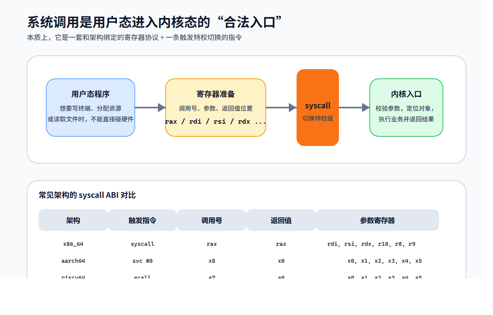

# 从 Hello World 到 syscall：为什么 Rust 的 `no_std` 是操作系统开发的第一道门

## 引言

很多人第一次接触 Rust 的 `no_std`，会把它理解成一句很简单的话：**不使用标准库**。

这句话当然没错，但如果只停留在这个层面，就很难真正理解 `no_std` 在操作系统开发里的意义。在内核、Bootloader、固件或者裸机程序之中，`no_std` 从来不只是“少了一个库”，而是意味着一整套默认前提的消失：

- 没有现成的运行时入口
- 没有默认的 panic 处理
- 没有现成的堆分配器
- 没有 `println!`
- 没有线程、文件、网络这些熟悉的 OS 抽象

也就是说，平时应用程序默认拥有的一切，在这里都要重新审视。也正因如此，`no_std` 才会成为 Rust 系统编程里的第一道门槛。

本文尝试从一个更接近系统实现的角度来理解 `no_std`。我们会从一个普通的 `println!` 出发，一路往下追到 `syscall`、内核、堆分配器和资源管理模型，看看一个“最小可运行程序”到底需要哪些支撑，以及为什么这些问题最终会把我们带到操作系统的核心地带。

不过在进入正文之前，先把本文的边界说清楚。**前半段讲的是用户态 `no_std` 示例**：也就是在 Linux 这样的现成操作系统里，如何绕开 `std` 和 libc，把程序收缩到 `core + asm! + syscall` 的最小路径。**后半段讲的是内核内部机制**：前面的示例并没有“变成内核”，这里只是借它继续往下解释 allocator、`Handle Table`、资源复用这些在内核里反复出现的设计模式。这样读起来，就不容易把“用户态最小程序”和“内核本体实现”混在一起。

---

## 一个 `println!` 背后，远不止一次输出

在用户态 Rust 程序里，下面这段代码实在太普通了：

```rust
fn main() {
    println!("hello");
}
```

但如果真的去追问“它是怎么把字符串打印到终端上的”，就会发现中间隔着很多层抽象。

从源码视角看，它通常先把格式化参数展开成 `format_args!`，再交给 `std::io::stdout()`、锁和缓冲区，然后才落到 `Write::write_fmt`，最后通过 libc 的 `write` 进入内核。

从调用链看，大致是这样一条路径：

```text
println!()
  -> format_args! / std::io::Write
  -> stdout lock / buffer
  -> libc::write
  -> syscall(SYS_write, ...)
  -> 内核 sys_write
  -> fd_table[1]
  -> 终端设备驱动
```

这里真正值得注意的，不是“打印”这件事本身，而是它经过了哪些中间层。`println!` 看起来像一个简单的宏，但它背后默认了格式化框架、缓冲策略、标准输出句柄、错误处理和系统调用边界，甚至默认了终端这个资源已经存在。也就是说，`println!` 并不是一个单纯的“输出函数”，而是应用程序站在完整操作系统之上时才成立的一种高级语义。

在应用开发里，这些细节大多被 `std` 和 libc 屏蔽掉了，所以我们几乎不会主动去想：输出到终端这件事，为什么最终会变成一个系统调用？为什么 `1` 代表标准输出？为什么写字符串之前还要经历格式化、缓冲、加锁、错误处理，以及一次从用户态到内核态的切换？再进一步说，程序启动和退出前后，为什么还会牵出初始化与收尾动作？

而 `no_std` 的价值，恰恰就在于它逼着你直面这些问题。它会把那层熟悉的封装撕开，让你重新看到程序和操作系统之间真正的边界。


如果按课件里的实验先跑一遍 `strace ./hello 2>&1 | wc -l`，你会看得更直观一些：在示例里，普通 `println!` 版本会带出 47 次 syscall。其中不只有 `write`，还常常能看到 `mmap`、`mprotect`、`brk`、`read`、`sigaction`、`exit_group` 这类初始化和收尾动作。它们并不是“多余噪声”，而是标准库、运行时和 libc 在悄悄替你铺路。

而当我们把程序改成 `no_std`，再自己直接发起 `write` 时，`strace` 会缩到几乎只剩骨架：

```text
execve("./target/debug/demo-nostd", ...)  = 0
write(1, "Hello, OS!\n", 11)             = 11
exit(0)                                   = ?
```

这里的 `execve` 是加载程序时不可避免的入口；但在程序体内部，真正主动发起的已经只剩 `write + exit`。这才是 `no_std` 最有力量的地方：它不是把程序变简单，而是把程序边界压缩到只剩必要路径。再做一个小实验，把 `rax = 1` 改成 `rax = 0`，`write` 就会变成 `read`，程序不再输出，而是直接卡在等待输入上。syscall 编号只差一个，行为就会完全不同。


---

## `no_std` 到底去掉了什么

Rust 的库大致可以分成三层：

- `core`：零依赖的语言核心能力
- `alloc`：依赖分配器的动态内存能力
- `std`：依赖操作系统的完整标准库

这三层关系很重要，因为它直接决定了 `no_std` 的真实含义。很多初学者一看到 `#![no_std]`，脑子里会立刻把它翻译成“Rust 功能被砍掉了很多”；但更准确的理解应该是：**Rust 语言能力没有消失，消失的是一整套“外部世界已经准备好了”的默认契约。**

也就是说，`core`、`alloc`、`std` 的差别，并不只是“功能多少”的差别，而是“程序对运行环境提出了多强假设”的差别：

- `core` 假设最少。它只关心语言如何表达计算、所有权、切片、格式化这些纯内部问题，不假定有进程、文件、时钟或堆。
- `alloc` 比 `core` 多走一步。它开始假定“有一块可动态分配和回收的内存”，于是才能谈 `Vec`、`String`、`Box` 这种会生长、会搬家的值。
- `std` 则进一步假定“已经有一个像样的宿主世界”。它默认进程可以启动和退出，stdout 已经存在，文件系统能打开路径，线程能被调度，时间源和网络栈也已经就位。

这样一看，`#![no_std]` 真正拿掉的就不是某几个 API，而是最上面那层环境契约。也正因为这三层是叠起来的，我们才能看清楚：平时到底是哪一层在替我们承担责任。

### `core`

`core` 里已经有很多 Rust 最重要的基础设施：

- `Option`、`Result`
- trait 和泛型
- slice、str
- 原子操作
- `fmt` 格式化框架

它不依赖操作系统，因此天然适合最底层环境。更准确地说，`core` 解决的是“语言怎么表达计算、数据和控制流”，而不是“程序怎么跟操作系统打交道”。所以在裸机、Bootloader、内核早期初始化这类场景里，哪怕运行时还没搭起来，`core` 依然能先撑住最基本的代码组织。

这里有一个很关键的认识：**`core` 之所以能成为系统编程的起点，不是因为它“够简陋”，而是因为它把语言层和环境层切开了。** 你仍然可以有类型系统、模式匹配、错误传播和 trait 抽象，甚至可以写得很像现代 Rust；只是这些能力此时还没有借助外部世界来兑现。它给你的不是“贫瘠语言”，而是一套不预支环境承诺的语言核心。

但如果再往下看，系统代码真正最早会碰到的，往往不是 `Vec` 这类“大结构”，而是更原始的字节操作：复制、清零、搬运和比较。按课件里的顺序看，最先要补出来的一组基础轮子通常就是 `memcpy`、`memset`、`memmove`、`strlen`、`strcmp`。放到 Rust 里，更准确的落点通常是 `core::ptr` 和裸指针遍历，而不是一套现成的同名标准函数库。

比如复制内核镜像、清空 BSS、在没有 `std` 的环境里搬运字节时，最先需要的往往就是这些操作：

```rust
pub unsafe fn memset(dst: *mut u8, byte: u8, len: usize) {
    core::ptr::write_bytes(dst, byte, len);
}

pub unsafe fn memcpy(dst: *mut u8, src: *const u8, len: usize) {
    core::ptr::copy_nonoverlapping(src, dst, len);
}

pub unsafe fn memmove(dst: *mut u8, src: *const u8, len: usize) {
    core::ptr::copy(src, dst, len);
}

pub unsafe fn strlen(mut s: *const u8) -> usize {
    let mut len = 0;
    while *s != 0 {
        len += 1;
        s = s.add(1);
    }
    len
}

pub unsafe fn strcmp(mut a: *const u8, mut b: *const u8) -> i32 {
    while *a != 0 && *a == *b {
        a = a.add(1);
        b = b.add(1);
    }
    (*a as i32) - (*b as i32)
}
```

这里面每个函数都很小，但承担的责任并不一样。`memcpy` 假定源和目标不重叠，因此可以采用最直接的复制方式；`memmove` 则是在重叠场景下保证正确性；`memset` 用来做成片清零，比如清 BSS；`strlen` 和 `strcmp` 则把“以 `\0` 结尾的字节串”这套 C 世界最常见的约定补回来。也就是说，课件这里要你补的并不是几个孤零零的名词，而是一组足以把最底层字符串/内存操作重新搭起来的基本接口。

这些函数本身并不花哨，但它们提醒我们一件事：`no_std` 真正逼你补的，常常不是“大结构”，而是这些看起来不起眼、却决定底层代码能不能跑起来的地基。系统代码最早面对的问题，往往不是“我怎么设计一个漂亮抽象”，而是“我连这一段内存都还没搬明白”。只有地基先稳住，`alloc` 才轮得到去接管更高一级的动态内存。

如果要把这一组函数真正写到“足以支撑实现”的程度，还必须把它们各自的**前置条件**和**不变量**讲死，而不能停在“名字我认识”：

- `memcpy(dst, src, len)` 的前提是源区间和目标区间**不重叠**。一旦重叠，就不能再偷懒用 `copy_nonoverlapping`，否则语义上就已经错了。
- `memmove(dst, src, len)` 的意义正是在于它要对重叠负责。也就是说，它不是“和 memcpy 差不多的另一个版本”，而是“在更强约束下仍然保证正确”的那个版本。
- `memset(dst, byte, len)` 最常见的系统用途不是“把某个 buffer 改一改”，而是做成片初始化，比如清 `.bss`、重置页帧、擦除临时缓冲区。
- `strlen(s)` 的前提不是“这是一段字符串”，而是“从 `s` 开始的可访问内存里**某处一定存在 `\0` 终止符**”。如果这个前提不成立，它就会一直读下去，越界只是时间问题。
- `strcmp(a, b)` 比较的不是 Rust `str`，而是两段以 `\0` 结尾的 C 风格字节串。它依赖的是字节约定，不是 UTF-8 语义，也不关心 Unicode 字符边界。

换句话说，这些函数之所以会成为第一批练习，不是因为它们“简单”，而是因为它们第一次强迫你在代码里对“哪种输入合法、哪种输入非法、正确性到底依赖什么”说清楚。系统实现里很多 bug，并不是算法太复杂，而是边界条件从一开始就没被声明清楚。

如果把它们放回课件的练习语境里看，`mem_primitives` 真正训练的也不是“重写几个 C 函数”，而是三件更底层的能力：

1. 你能不能在没有 `std` 的前提下只靠 `core::ptr` 和裸指针把语义重新搭起来。
2. 你能不能区分“接口名字相近”和“语义责任不同”，例如 `memcpy` 与 `memmove` 的差别。
3. 你能不能开始接受一种系统编程里的常态：**函数的正确性不是由类型替你兜底，而是由你自己守住前置条件。**

也正因如此，这一组函数最好不要只停在“能跑”的程度，还要继续追问几件事：重叠时会不会错？长度为 0 时应不应该安全返回？空指针在 `len = 0` 时要不要特殊处理？比较到第一个不同字节时为什么就该停？这些问题一旦想清楚，后面 allocator、`fd_table`、syscall 封装里那些“接口契约先于实现细节”的味道就不会显得突兀。

### `alloc`

`alloc` 提供的是动态内存相关的能力，例如：

- `Vec`  `Box`  `String`   `Arc`

但它有一个前提：你必须先提供全局分配器。这个前提非常关键，因为它说明 `alloc` 其实没有“凭空制造内存”，它只是建立在“已经有人会分配内存”的基础上，把这些原本很原始的内存块组织成 `Vec`、`String`、`Box` 这样的高级容器。

这件事的深层意义在于：**`alloc` 不是内存的来源，它只是内存之上的秩序。** 它关心的是增长、收缩、所有权转移、容量管理、引用计数这些“怎么把动态内存变成有语义的值”的问题；至于“那一块内存到底是谁给的”，则完全推给更下层。因此，`alloc` 已经比 `core` 更进一步，但它仍然不是“操作系统接口层”，它只是“分配器之上的语言容器层”。

### `std`

`std` 则进一步建立在 `core + alloc + OS 支持` 之上，里面才有：

- 文件系统
- 网络
- 线程
- 时间
- 标准输入输出

到了这一层，程序才真正开始把“外部世界”当成默认存在的东西来使用。换言之，`std` 提供的不只是几个方便 API，更是一整套默认前提：有文件描述符、有线程模型、有时间源、有 I/O 设备，也有进程退出路径。对应用开发来说，这些前提理所当然；对内核和裸机代码来说，这些前提恰恰都是尚待建立的东西。

这也是为什么 `std` 对系统编程者来说并不只是“太重了”，而是“太早了”。因为它默认你站在一栋已经盖好的楼里写代码，而操作系统开发很多时候恰恰是在讨论：楼梯在哪，门怎么开，电源有没有接上，连地基是不是平的都还没确认。

所以：

```rust
#![no_std]
```

真正的含义不是“什么都不能用了”，而是：**程序不再链接 `std`，不能再默认依赖操作系统能够提供完整运行环境。**

因此，很多初学者容易误解：

- `no_std` 不等于不能使用 Rust 语言本身
- `no_std` 不等于完全不能动态分配
- `no_std` 只是意味着这些能力不会再被自动准备好

如果沿着课上的 live coding 节奏看，当前阶段常常会先刻意只用 `core`，暂时不接 `alloc`。但这只是教学顺序，不是语言边界。更准确地说，`no_std` 程序可以只用 `core` 起步，也可以在你自己提供分配器之后，把 `alloc` 接回来。

![Rust 三层库关系与 `#![no_std]` 的影响](no_std_article_png/02-rust-lib-stack.png)

---

## 从空文件到最小 `no_std` 程序

最能体现 `no_std` 本质的，不是概念解释，而是从空文件一路踩报错，最后拼出一个最小示例。

```rust
#![no_std]
#![no_main]

use core::panic::PanicInfo;

#[panic_handler]
fn panic(_: &PanicInfo) -> ! {
    loop {}
}

#[no_mangle]
pub extern "C" fn _start() -> ! {
    loop {}
}
```

如果你是在 Linux 里复现这个最小示例，通常还需要关掉默认启动文件，比如 `-nostartfiles` 或 `-C link-args=-nostartfiles`。否则，链接器仍然会塞入 CRT 启动代码，把 `_start`、`main` 和一堆初始化逻辑补回来。

按课上的推进顺序，这个最小程序通常不是一口气写出来的，而是这样三步踩出来的：

1. 先加 `#![no_std]` 和 `#![no_main]`
   结果不是“直接更底层了”，而是先报错：缺少 `panic_handler`。
2. 再补上 `#[panic_handler]`
   这时编译器不再抱怨 panic，但链接器会继续报：找不到 `_start`。
3. 最后补 `_start`，再加 `-nostartfiles`
   到这一步程序才真正链接通过，只不过它什么都不做，只会卡在死循环里。

这条报错链非常重要，因为每一步都在反过来告诉你：平时的 `std` 和运行时到底替你做了什么。少了 `panic_handler`，说明连“失败时怎么办”都不是自动给出的；缺 `_start`，说明连“从哪里开始执行”都不是语言自动决定的；还要关掉 `-nostartfiles`，则说明即使你自己写了入口，工具链也可能替你补回一层旧世界的默认假设。

如果把这三步继续往下拆，就会发现它们分别对应三种不同的责任边界：

- `panic_handler` 暴露的是**语义责任**：程序内部一旦出现不可恢复错误，谁来定义“失败”是什么意思。
- `_start` 暴露的是**控制流责任**：加载器把 CPU 控制权交给你时，第一条进入你代码的路径到底是什么。
- `-nostartfiles` 暴露的是**工具链责任**：就算语言层面你已经选择了 `no_std`，链接阶段仍然可能有别的组件替你假定“这里应该像普通应用程序一样启动”。

因此，这里不是单纯在补三个技术细节，而是在一层层拆掉“普通用户态程序”默认拥有的支架。

这个程序几乎什么都没做，但它已经把 `no_std` 下最核心的运行时职责暴露出来了：入口、panic、退出路径，原本都不是“你顺手写不写”的问题，而是“没有标准库之后，必须由谁来负责”的问题。`no_std` 最难的地方，往往不在语法，而在这种责任的前移。原来在应用程序里被藏起来的东西，现在都被摆到了桌面上。

一个“死循环空程序”在这里反而有教学价值。它几乎没有业务逻辑，所以所有你平时意识不到的运行时骨架都会暴露得很干净。你会更清楚地感觉到：所谓“程序运行”，本来就不是从 `main` 开始的，而是从一整套入口、初始化、异常和退出约定被满足之后才成立。


### 1. 没有默认的 `main`

平时写 Rust 程序时，我们只需要写一个 `main`，剩下的启动流程都由运行时处理；但进入 `no_std` 之后，这套默认启动逻辑不再存在，于是你必须自己提供入口点，例如 `_start`。它才是加载器把控制权交给你之后，真正进入用户代码的地方。

不过这里要补一句很容易被误解的话：`_start` 不是“裸机上的第一条指令”，也不是“从零开始、世界就什么都没有”。如果场景还是 Linux 用户态，那么在 `_start` 之前，内核已经替你做完了 ELF 加载、地址空间建立、用户栈初始化这些准备工作。也就是说，**不用 `std` 不等于不用操作系统**；这里只是把 C runtime 和标准库那一层拿掉了，而不是把 Linux 也一起拿掉了。

### 2. 没有默认的 panic 行为

标准库会帮你决定 panic 时是打印信息、展开栈还是直接中止；而 `no_std` 下，这一切都不再自动存在，所以必须自己实现 `#[panic_handler]`。最小实现当然可以只是死循环，但它本质上是在声明：这里的失败如何收尾，由你负责。

### 3. 程序从“业务逻辑”退回到了“运行时搭建”

最重要的变化不是语法，而是职责边界。你不再只是“写程序逻辑”，而是在补一套最小运行时。`no_std` 程序之所以像在写系统，就是因为入口、异常、退出和环境准备都必须自己交代。

---

## 系统调用：用户态和内核态之间唯一合法的门

一旦没有了 `println!`，最自然的问题就是：那我怎样把字符串输出到终端？

答案是：直接发起系统调用。

系统调用是用户态程序向内核请求服务的标准方式。这里“唯一合法的门”并不是修辞，而是保护边界本身的要求：用户程序不能随便跳进内核函数，更不能直接碰硬件寄存器，否则整个隔离模型就不存在了。它必须通过约定好的 ABI，把参数放到指定寄存器中，再执行特定指令，由 CPU 完成一次特权级切换，随后由内核接管执行。课上用了一个很形象的类比：像去政务大厅办事。你先填表（把参数放进寄存器），再去窗口提交（执行 `syscall` / `ecall` / `svc #0`），最后拿回结果（读返回值）。

这里最值得理解的，不是“syscall 是个指令”，而是**为什么必须有这样一条受控边界**。因为内核掌握的是全局资源和更高权限，用户态掌握的是不可信的请求。系统调用这道边界的意义，就是把“能力”和“申请能力”分开。用户程序只能描述自己想做什么，不能直接替内核决定怎么做。

以 `x86_64` 为例，`rax` 放调用号，`rdi/rsi/rdx/...` 放参数。执行 `syscall` 后，CPU 会把返回地址写进 `rcx`，把 `RFLAGS` 写进 `r11`，然后跳到内核预设的入口；内核收到调用号后，再分发到 `sys_write` 之类的处理函数，处理结束后返回用户态。

不同架构的 syscall 约定并不完全相同：

| 架构 | 触发指令 | 调用号寄存器 | 返回值寄存器 | 参数寄存器 |
|---|---|---|---|---|
| `x86_64` | `syscall` | `rax` | `rax` | `rdi, rsi, rdx, r10, r8, r9` |
| `aarch64` | `svc #0` | `x8` | `x0` | `x0, x1, x2, x3, x4, x5` |
| `riscv64` | `ecall` | `a7` | `a0` | `a0, a1, a2, a3, a4, a5` |

其中，`x86_64` 还要额外注意 `rcx` 和 `r11` 会被硬件改写：前者会被写成返回地址，后者会被写成 `RFLAGS`，所以在内联汇编里必须显式声明。`asm!` 只是把这种机器级协议原样写出来，`syscall3` 则是把它整理成一个可复用的最小封装。再进一步说，Linux 下的 `aarch64` 和 `riscv64` 共享 `asm-generic` 的系统调用编号，而 `x86_64` 则保留着一套历史沿袭下来的编号体系。

但如果目标不是“背会一张表”，而是“真写出能扩展的 syscall 封装”，那只列寄存器还不够，还要把 ABI 当成一份**可编码的数据**来看。最小的思路通常是先把“触发指令、调用号寄存器、返回值寄存器、参数寄存器顺序、额外 clobber”抽成一份描述，再让不同架构各自实现：

```rust
struct SyscallAbi {
    arch: &'static str,
    insn: &'static str,
    nr: &'static str,
    ret: &'static str,
    args: &'static [&'static str],
    clobbers: &'static [&'static str],
}
```

这类结构体本身不负责发起系统调用，但它会强迫你把“我到底依赖了哪些寄存器约定”显式写出来。课件 `slide 13` 要求“给三个架构都写 `syscall3`，并填写 ABI 描述结构体”，本质上就是在训练这种能力：**不要把架构差异散落在几十个调用点里，而要把它压缩进统一边界。**

这里还有一个非常容易漏掉、但一旦实现 `syscall4`/`syscall5` 就绕不过去的细节：在 `x86_64` Linux ABI 里，第 4 个参数放在 `r10`，而不是很多人凭直觉会写的 `rcx`。这不是因为“约定很怪”，而是因为 `syscall` 指令本身会覆盖 `rcx`，所以它不能安全承担第 4 个参数。也就是说，**不是我们偏要记怪表，而是硬件行为先决定了 ABI 的样子。**

因此，一旦你开始写真正可用的 syscall 封装，最好马上形成下面这种分层意识：

- `syscall3` 只是一种“当前只处理 3 个参数”的局部封装，不是系统调用世界的完整模型。
- 当参数数量增加时，变化的不是 “write 这个概念”，而是“寄存器摆放规则”。
- 架构抽象的价值不在于把差异抹平，而在于把差异集中到一处。

从实现角度看，一个比较稳的接口分层通常会长成这样：

```text
sys_write(fd, buf)
    -> syscall3(SYS_write, fd, ptr, len)
        -> arch-specific asm! sequence
            -> CPU privilege transition
```

最上层谈的是“写文件描述符”，中间层谈的是“3 参数系统调用”，最下层谈的是“这个架构到底用哪些寄存器和哪条指令”。如果这三层搅在一起，代码一开始也许能跑，但一加第二个架构就会迅速失控。

这张表已经说明了很多事情。它不只是“不同架构记法不同”这么简单，而是在提醒你：一旦离开 `std` 和 libc，所谓接口就不再是函数签名，而是寄存器、调用号和指令约束本身。

应用层看到的是 `write(fd, buf)` 这样的名字；系统层真正维护的却是“哪个寄存器装编号、哪个寄存器装参数、执行哪条指令、哪些寄存器会被破坏”。两种视角差得很远，而 `no_std` 的学习价值就在于，它逼你从前一种视角走到后一种视角。

- 系统调用本质上是寄存器协议
- 用户态和内核态的交互是高度架构相关的
- “系统接口”并不是一个抽象概念，而是一套可以落到寄存器和指令级别的具体约定



---

## 用 `asm!` 手写一个最小版 Hello

如果我们完全绕开 `std` 和 libc，直接在 `no_std` 程序里发起 `write`，代码会长得非常底层：

```rust
#[no_mangle]
pub extern "C" fn _start() -> ! {
    let msg = b"Hello, OS!\n";
    unsafe {
        core::arch::asm!(
            "syscall",
            in("rax") 1usize,        // SYS_write
            in("rdi") 1usize,        // stdout
            in("rsi") msg.as_ptr(),
            in("rdx") msg.len(),
            out("rcx") _,
            out("r11") _,
        );

        core::arch::asm!(
            "syscall",
            in("rax") 60usize,       // SYS_exit
            in("rdi") 0usize,
            options(noreturn),
        );
    }
}
```

这段代码很粗糙，但很有意义。因为它把“输出一行文本”这件事还原成了最原始的形态：

- `rax = 1` 表示 `write`
- `rdi = 1` 表示向 `stdout` 写
- `rsi` 是缓冲区地址
- `rdx` 是长度

此时你看到的已经不是“打印字符串”，而是“按 syscall ABI 向内核请求一次写操作”。这一步的意义在于，它把一个高层动作拆成了几个完全可枚举的底层责任：选对 syscall 编号、把 fd 放对寄存器、把缓冲区地址和长度传进去、声明会被硬件破坏的寄存器，然后处理返回值。事情并没有变得“更神秘”，而是第一次变得足够诚实。

这份“诚实”很重要，因为系统编程里很多抽象之所以可靠，前提恰恰是你先知道它到底替你遮住了什么。如果连一次最原始的 `write` 都没自己拆开过，后面再谈 syscall 封装、I/O 抽象、文件对象、驱动边界，就很容易流于背接口而不是理解接口。

从这里开始，我们才真正接触到系统编程的核心：用户程序表面上的高级操作，最终都会被压缩成很少几条极底层的接口调用。

---

## 从裸汇编到 `syscall3`：抽象开始出现

直接写汇编虽然直观，但显然不适合作为长期接口。原因不只是“难看”，而是它会把所有调用点都绑死在一套脆弱的寄存器细节上：一旦你要换架构、补错误处理、复用参数约束，或者只是想减少重复，就会发现每个调用点都在复制同一份 ABI 细节。所以我们接下来要做的，就是把这类系统调用封装成统一函数。

```rust
unsafe fn syscall3(
    id: usize,
    arg0: usize,
    arg1: usize,
    arg2: usize,
) -> isize {
    let ret: isize;
    core::arch::asm!(
        "syscall",
        inlateout("rax") id => ret,
        in("rdi") arg0,
        in("rsi") arg1,
        in("rdx") arg2,
        out("rcx") _,
        out("r11") _,
    );
    ret
}
```

这里 `inlateout("rax") id => ret` 是一个很关键的点：`rax` 在进入内核前装的是 syscall 编号，返回用户态后又会被拿来装返回值。换言之，同一个寄存器在调用前后承担了两种角色，所以这里既不是纯输入，也不是纯输出，而是“先输入，再输出”。

再往上包一层，就能得到更有语义的接口：

```rust
fn sys_write(fd: usize, buf: &[u8]) -> isize {
    unsafe { syscall3(1, fd, buf.as_ptr() as usize, buf.len()) }
}

fn sys_exit(code: usize) -> ! {
    unsafe { syscall3(60, code, 0, 0); }
    loop {}
}
```

这一步看似只是“代码整理”，其实非常像系统软件里的真实分层。它的重要性不在于“代码更短了”，而在于 **接口边界开始稳定了**：最底下那层仍然懂 ABI，但上层终于可以开始用“写”“退”“读”这种语义来思考，而不是每次都重新思考寄存器摆放。

更深一层说，`syscall3` 这种封装做的不是“隐藏底层”，而是**把变化约束在一处**。以后如果你要适配别的架构、统一错误码处理、补 trace、做 mock，或者把 `write` 换成更高层的 `Console::write_str`，你都不会希望几十个调用点分别去记寄存器协议。分层的价值，本质上就是把易变细节压缩到最少位置。

- 最底层是指令和 ABI
- 往上一层是 syscall 封装
- 再往上才是更稳定、更语义化的系统接口

顺着这个思路再往上看，系统调用的返回值也不是普通函数那种“成功就自动兜底”的体验；它经常把错误信息编码成负值，留给上层自己解释。以 Linux 为例，返回值如果落在 `-1..=-4095`，通常就表示 `-errno`。也就是说，底层 `syscall3` 拿回来的首先是一个机器约定下的 `isize`；上层才会把它翻译成更像 Rust 的语义：

```rust
fn ret_to_result(ret: isize) -> Result<usize, i32> {
    if ret < 0 {
        Err((-ret) as i32)
    } else {
        Ok(ret as usize)
    }
}
```

这样一来，`syscall` 层和 `Result` 层的分工就清楚了：前者负责正确完成“寄存器协议 + 特权级切换”，后者负责把负值错误码重新解释成“成功/失败”的语言级语义。`syscall3` 只是把寄存器协议包起来，真正的语义还得继续往上层封装。


到这里，我们已经开始从“直接和硬件协议打交道”过渡到“自己设计抽象层”。这恰恰就是操作系统实现的常见模式。

如果把视角放到别的架构，这种“底层协议相同、封装细节不同”的味道会更明显。最小伪代码大致可以写成下面这样：

```rust
// aarch64
unsafe fn syscall3_aarch64(id: usize, a0: usize, a1: usize, a2: usize) -> isize {
    let ret: isize;
    core::arch::asm!(
        "svc #0",
        inlateout("x0") a0 => ret,
        in("x1") a1,
        in("x2") a2,
        in("x8") id,
    );
    ret
}

// riscv64
unsafe fn syscall3_riscv64(id: usize, a0: usize, a1: usize, a2: usize) -> isize {
    let ret: isize;
    core::arch::asm!(
        "ecall",
        inlateout("a0") a0 => ret,
        in("a1") a1,
        in("a2") a2,
        in("a7") id,
    );
    ret
}
```

这里最值得看的不是语法细节，而是封装差异：`x86_64` 要额外处理 `rcx/r11` clobber；`aarch64` 把调用号放在 `x8`；`riscv64` 则放在 `a7`。所以跨架构适配时，真正会变的不是“`write` 这个概念”，而是 syscall 封装最底下那一小层汇编约定。


---

到这里为止，本文前半段讲的都还是**用户态 `no_std` 示例**：在现成 Linux 环境里，把 `std`、libc 和默认运行时支架一层层拿掉，看看一个最小程序到底还剩什么。下面开始切到后半段：借这个例子继续解释内核内部反复出现的设计模式，比如 allocator 怎样承接 `alloc`、`Handle Table` 怎样承接资源生命周期。这一步不是场景偷换，而是视角切换。

## 为什么 `no_std` 很快就会引出分配器

一旦把 `std` 拿掉，很多平时习以为常的能力都会立刻暴露出底层依赖，堆分配就是其中最典型的一个。更关键的是，它不是孤零零冒出来的，而是顺着前面的逻辑自然长出来的：当你已经开始自己负责输出、自己负责入口、自己负责 syscall 之后，下一个迟早会碰上的问题就是“动态内存到底谁来给我”。

在应用程序里，像 `String`、`Vec`、`format!` 这类东西看起来很自然；但在系统编程里，它们背后都隐含着一个问题：**内存是从哪来的？**

课件里用过一句很直白的话：有 `std` 的时候，`format!("{}", 42)` 这种操作会一路落到 `String -> malloc -> brk/mmap -> 内核`；而在 `no_std` 里，没有现成的 `malloc`，你自己就是那个提供 `malloc` 的人。于是问题立刻反转：

不是“我如何使用内存分配器”，而是“我如何先造出一个内存分配器”。

这也是操作系统开发里非常典型的“自举”问题。参考内核开发的讨论可以发现，内存管理往往必须从一个极小、极朴素的 early allocator 起步，再逐步进化到更完整的分配框架。分配器的本质其实并不神秘：你手里有一块内存，有人来要 16 字节，你切一块给他，再记住哪些已经用掉、哪些还空着。真正困难的地方不在定义，而在于这种“谁都还没搭好时，我得先拿最小机制把系统托起来”的局面。

因此，allocator 在这篇文章里的地位并不是“顺手补一个算法题”，而是系统开发思维的一次转折：从前面处理入口和 syscall 这类控制流边界，转到开始处理“长期资源如何被组织和复用”这个问题。程序已经不只是要能跑，还得开始学会管理自己消耗的空间。


---

## Bump Allocator：最简单，也最诚实

在所有 allocator 里，最适合用来理解问题本质的，是 Bump Allocator。因为在 `no_std` 里，`Vec`、`String`、`Box` 这些动态容器不会凭空出现，它们最终都要向 allocator 要内存。最小的做法不是一上来就实现完整 `malloc`，而是先做一个只会“往前切块”的 bump allocator：给它一段连续内存和一个偏移量，就能先让程序活起来。

它的逻辑极其简单：

1. 准备一段连续内存
2. 维护一个偏移量
3. 每次分配时从当前偏移继续切一块
4. 偏移向前移动

示意代码如下：

```rust
const HEAP_SIZE: usize = 128;
static mut HEAP: [u8; HEAP_SIZE] = [0; 128];
static mut OFFSET: usize = 0;

pub unsafe fn alloc(size: usize) -> *mut u8 {
    if OFFSET + size > HEAP_SIZE {
        return core::ptr::null_mut();
    }
    let ptr = HEAP.as_mut_ptr().add(OFFSET);
    OFFSET += size;
    ptr
}
```

 

它的优点非常明显：

- 实现简单
- 分配速度快
- 非常适合启动阶段和短生命周期对象

但它的问题同样直接：

- 不能释放
- 无法复用中间空洞

因此，Bump Allocator 之所以经典，不是因为它足够强，而是因为它把“分配器到底在做什么”解释得很清楚。堆分配器首先不是一个复杂黑盒，它只是管理一块内存，并决定下一块怎么切。最小实现里，你只需要记住两样东西：一块静态 heap 和一个当前偏移。分配时把偏移向前推进，不够就返回空指针，这就已经足够说明问题。它之所以“诚实”，就在于它几乎不替你掩盖任何代价：你切了就切了，走过去了就不会回来，浪费了就是浪费了。

不过要注意，课件要求并不是“理解一下 bump 思路就可以了”，而是要继续往真正的接口层推进：**实现 `GlobalAlloc` trait，并考虑并发下的线程安全。** 到了真正和 Rust 的 `alloc` 接口对接时，分配器面对的就不再只是“我要几字节”，而是 `Layout { size, align }` 这样的请求。也就是说，`Vec`、`Box`、`String` 在向下申请内存时，不会只说“给我一块”，而会把“我要多大”和“起始地址至少要按什么边界对齐”一起交给 allocator。

如果继续往“能支撑实现”的程度推进，那么这里最好把 `GlobalAlloc` 的接口直接落出来看一眼：

```rust
unsafe trait GlobalAlloc {
    unsafe fn alloc(&self, layout: Layout) -> *mut u8;
    unsafe fn dealloc(&self, ptr: *mut u8, layout: Layout);
}
```

这两个函数看起来很短，但语义一点也不轻。`alloc` 的要求不是“尽量分一块”，而是“要么返回一块满足 `layout.size()` 与 `layout.align()` 的合法区域，要么明确返回空指针表示失败”；`dealloc` 的要求也不是“顺手清零”，而是“把这块曾经按该 `layout` 借出去的空间，重新纳入分配器自己的管理结构”。一旦把责任说到这个程度，allocator 就不再是一个模糊概念，而是一个明确的接口契约。

如果把这个接口关系摊开来看，至少有三层东西必须讲清楚。

第一层是 **`Layout` 如何进入分配器**。`GlobalAlloc::alloc(&self, layout: Layout)` 收到的不是抽象名词，而是一次具体分配请求。分配器要先读 `layout.size()`，决定切多大；再读 `layout.align()`，决定当前 offset 是否要先向上补齐。也就是说，“对齐”并不是 bump allocator 的附加知识点，而是 `Layout -> alloc` 这条接口链路的一部分。

第二层是 **`alloc/dealloc` 的接口责任**。`alloc` 的责任不是“尽量给一块差不多的内存”，而是“返回一块满足 `Layout` 约束的可用区域；做不到就返回空指针”。`dealloc` 的责任也不是“把字节抹零”，而是“把这块原先按同一 `Layout` 借出去的空间，重新纳入 allocator 的管理结构”。这也是为什么 bump allocator 很适合教学起步，但一谈 `dealloc` 就会暴露它的局限。

第三层是 **为什么教学代码里的 `static mut OFFSET` 在并发语境下不成立**。那个版本只适合说明“偏移量向前推进”这件事，但如果两个线程同时读到同一个 `OFFSET`，它们可能都会认为“下一块从这里开始”，于是返回重叠内存，直接破坏分配器不变量。更严重的是，`static mut` 的读写本身就没有同步保证，属于数据竞争。

所以一旦课件把目标抬到 `GlobalAlloc`，线程安全就不能只停留在口头上，通常要引入原子操作。例如，可以用 `AtomicUsize` 保存 bump 指针，再用 `fetch_update` 或 CAS 循环，把“读取当前 offset -> 按 align 对齐 -> 计算新 offset -> 提交”做成一个不可分割的更新过程。这样一来，多个线程同时分配时，只有一个线程能成功占到某一段区间，剩下的线程会基于新的 offset 重试，而不会都拿到同一块内存。

最小的线程安全 bump 分配器，思路往往会比教学版多出一个关键动作：**把“读旧 offset、算新 offset、提交新 offset”合并成一次原子更新**。伪代码可以写成这样：

```rust
use core::alloc::{GlobalAlloc, Layout};
use core::ptr::null_mut;
use core::sync::atomic::{AtomicUsize, Ordering};

struct BumpAlloc {
    offset: AtomicUsize,
}

unsafe impl GlobalAlloc for BumpAlloc {
    unsafe fn alloc(&self, layout: Layout) -> *mut u8 {
        let size = layout.size();
        let align = layout.align();

        let result = self.offset.fetch_update(
            Ordering::AcqRel,
            Ordering::Acquire,
            |old| {
                let aligned = (old + align - 1) & !(align - 1);
                let new = aligned.checked_add(size)?;
                (new <= HEAP_SIZE).then_some(new)
            },
        );

        match result {
            Ok(old) => {
                let aligned = (old + align - 1) & !(align - 1);
                HEAP.as_ptr().add(aligned) as *mut u8
            }
            Err(_) => null_mut(),
        }
    }

    unsafe fn dealloc(&self, _ptr: *mut u8, _layout: Layout) {
        // bump 版本通常先不回收，或只在整体 reset 时统一回收
    }
}
```

这段代码最值得看的不是语法，而是其中的不变量：

- `offset` 只能单调递增，不能倒退。
- 返回指针必须满足 `layout.align()`。
- 返回区间必须完整落在堆范围内，不能溢出。
- 多线程同时分配时，任何两个成功返回的区间都不能重叠。

一旦把这些不变量写清楚，你就会发现 bump allocator 虽然简单，但已经把很多真实 allocator 的核心责任暴露出来了：边界检查、对齐、失败路径、并发更新、接口契约。这也是为什么课程要你从这里起步，而不是一上来就扔一个成熟分配框架给你背。

---

## 对齐：分配器第一次真正面对硬件约束

当 allocator 再往前走一步，就会遇到一个无法回避的问题：**内存对齐**。内存对齐真正麻烦的不是“切一块内存”，而是“切出来的起始地址必须满足对象的对齐要求”。

很多对象并不是“随便给个地址就能放”。例如某些类型要求 4 字节、8 字节甚至更高的对齐边界。如果地址不满足要求，轻则性能下降，重则行为未定义或直接异常。

因此分配器往往需要先做“向上对齐”：

```rust
let aligned = (offset + align - 1) & !(align - 1);
```


这行代码表面上只是位运算，实际上却标志着系统编程中的一种典型变化：代码不再只满足语言层面的正确性，而要开始满足 ABI 和硬件层面的正确性。比如 `offset = 3`、`align = 4` 时，先算 `3 + (4 - 1) = 6`，再做 `6 & !3`，就会得到 `4`，也就是“向上补到下一个 4 的整数倍”。最小实现只要记住一个原则：先把 `offset` 向上补到 `align` 的整数倍，再把 `size` 切出去。

也正是在这些地方，`no_std` 的学习价值会越来越明显。因为标准库平时帮你挡住了这些问题，而系统开发必须正面处理它们。

---

## 如果还想 `free`：从 Bump 走向 Free List

Bump Allocator 有一个很致命的限制：它只会往前走，不会回头。问题不在性能，而在回收不了。

假设我们依次分配了 A、B、C，然后释放 B。对于 bump 来说，这块中间空洞几乎等于“丢了”，因为它没有机制知道该如何复用它。

这就引出了更进一步的设计：Free-List Allocator。最小做法不是上来搞复杂堆管理器，而是把释放掉的块重新串进一个空闲链表里。

它的基本思想是：

- 被释放的块进入空闲链表
- 新的分配请求先在空闲链表中查找
- 如果能找到合适块，就优先复用

进一步还可以使用侵入式链表，把元数据直接存在空闲块本身里面，避免额外开销。分配时先扫链表，能复用就复用；找不到合适块，再继续向后切。这就已经足够说明“free”到底意味着什么了。它不是一句“把内存还回去”就结束了，而是把原本失效的一块区域重新变成“系统知道如何再次利用的资源”。

这句话值得再强调一次：**释放的本质不是消失，而是重新纳入管理。** 如果系统只是“知道某块东西没人用了”，却不知道该怎样重新找到、重新标记、重新复用它，那从资源管理角度看，这块空间和丢了几乎没有区别。

因为空闲块反正已经空出来了，把 `next` 和 `size` 直接塞回块里，等于连元数据也一起回收了。

如果真要把 free list 写到“足以支撑实现”，那这里还必须把空闲块自己的结构说清楚。最小版本里，空闲块通常至少要记住两件事：

```rust
struct FreeBlock {
    size: usize,
    next: Option<*mut FreeBlock>,
}
```

这意味着 free list 并不是“有一串空洞”这么抽象，而是“每个空闲块都把自己的大小和下一个空闲块的位置记在自己体内”。这就是所谓侵入式链表：元数据不额外放到别处，而是直接占用空闲块本身的前几个字节。

但只把块串起来还不够，真正实现时至少还要做三个决策：

1. **怎么找块**：最小版本通常用 first-fit，也就是从链表头开始，找到第一块够大的就用。它实现最简单，但未必最省碎片。
2. **要不要拆块**：如果请求 32 字节，而某个空闲块有 128 字节，那么是整块拿走，还是切出 32 字节、把剩下部分重新挂回链表？如果不拆，内部碎片会很快变严重。
3. **要不要合并**：如果两个空闲块在地址上正好相邻，释放后是否把它们并成一个更大的块？如果从不合并，外部碎片会越来越多。

也就是说，free list 的难点从来不只是“能 free”，而是“free 以后系统还能不能长期保持可复用”。一旦你真正开始写代码，就会发现自己在维护的是一组持续成立的不变量：

- 空闲链表中的每个块都必须指向合法地址范围。
- 空闲块之间不能重叠。
- 被分配出去的块绝不能继续留在 free list 中。
- 如果支持拆分，那么拆出来的剩余块也必须继续满足最小块头大小和对齐要求。

这时“对齐”也不会自动消失。即便从 free list 里复用旧块，返回给调用者的起始地址仍然必须满足 `Layout::align()`。因此，一个真正可用的 free list allocator，往往不仅要比较 `size` 是否足够，还要检查这块在对齐后还能不能留下合法的剩余空间。把这一步想明白，就能看出为什么课件把 `bump -> alignment -> free list` 排成了一个连续梯度：它不是三个并列的知识点，而是一条逐步逼近真实 allocator 的实现路径。


---

## `fd_table`：为什么 `write(1, ...)` 里的 `1` 如此重要

理解了系统调用和分配器之后，另一个很自然的问题是：为什么 `write(1, buf, len)` 里的参数是 `1`？

这个 `1` 当然不是魔法数字。它代表的是一个文件描述符，也就是用户态程序持有的资源凭证。为什么内核要这么设计？因为用户态不应该拿到内核对象的裸指针，也不应该直接操纵资源内部结构；它拿到的只能是一个受控的、可检查的、可回收的整数句柄。

这个“间接一层”的设计其实意义非常深：

- 它把用户可见标识和内核真实对象地址分开了，避免用户态直接碰内部实现。
- 它让内核可以在使用前做合法性检查，比如这个 fd 是否存在、是否有权限、是否已经关闭。
- 它让资源可以被复用、迁移、共享，而不要求用户态知道背后对象是不是还在原地址。

最小实现里，它就是一个槽位数组：`Vec<Option<...>>` 或静态表。`open` 找到第一个 `None` 填进去并返回索引；`close` 把槽位改回 `None`；如果某个资源还能被多个地方共享，就让它挂在同一个槽位后面，像 `Arc` 这样的共享所有权机制正好负责把生命周期兜住。

在内核里，它通常会对应到某种句柄表结构：

```text
0 -> stdin
1 -> stdout
2 -> stderr
3 -> None
4 -> log_file
...
```

于是，`write(1, ...)` 的真实含义就变成了：

1. 用户程序拿着句柄 `1`
2. 内核在 `fd_table` 里查到它对应的是 `stdout`
3. 然后把写请求转交给对应的设备或文件对象

把这条链再跑完整一点，会更容易看出 `Handle Table` 的生命周期逻辑。假设当前表是：

```text
0 -> stdin
1 -> stdout
2 -> stderr
3 -> None
4 -> None
```

这时进程执行一次 `open("log.txt")`。内核扫描到最小空槽是 `3`，于是把一个 `Arc<dyn File>` 形式的文件对象放进 `fd_table[3]`，再把整数 `3` 返回给用户态。接下来，用户态执行 `write(3, ...)` 或 `read(3, ...)` 时，内核都会先查 `fd_table[3]`，再把请求转发给这个文件对象上的 `write/read` 方法。之后如果进程 `close(3)`，表项会被置回 `None`；下一次再 `open("config.txt")` 时，最小空槽仍然是 `3`，这个 fd 就会被复用。这样一来，`open -> 返回最小空槽 -> write/read -> close -> 槽位复用` 这整条链就闭合了。


这里之所以常写成 `Arc<dyn File>` 而不是 `Box<dyn File>`，关键不在“语法更高级”，而在所有权模型。`Box` 表示唯一拥有者，适合“这个对象只会被一个地方独占”的场景。但句柄表里的文件对象经常会同时被多个位置引用：fd 表里有一份，某次 I/O 路径上可能临时 clone 一份；进一步的内核设计里，还可能出现 `dup`、`fork` 后父子进程共享打开文件等情况。`Arc` 允许这些引用并存，只有当最后一个引用离开时，对象才真正析构；这比“close 时立刻 drop 一个 `Box`”更贴近真实内核里“句柄关闭”和“对象生命结束”并不总是同一步的事实。

如果把这一节写到能直接反推实现，最好再把 `fd_table` 的接口不变量单独拎出来。一个最小但自洽的句柄表，至少要保证下面几件事：

- `open/register` 总是返回当前**最小可用索引**，这样复用规则才稳定、可预测。
- `read/write/close` 在真正触达对象前，必须先检查索引是否越界、槽位是否为空。
- `close(fd)` 的语义是“释放这个句柄对槽位的占用”，不是“无条件销毁底层对象”。
- 重复 `close`、访问空槽、访问越界，都应该走明确的错误路径，而不是静默成功。

如果把它写成伪接口，大概会像这样：

```rust
trait File {
    fn read(&self, buf: &mut [u8]) -> Result<usize, Error>;
    fn write(&self, buf: &[u8]) -> Result<usize, Error>;
}

struct FdTable {
    slots: Vec<Option<Arc<dyn File>>>,
}
```

在这个模型里，`Vec`、`Option`、`Arc`、`dyn File` 各自负责的事情其实应该说得非常明确：

- `Vec` 负责“表可以增长”，也就是句柄空间不是死的。
- `Option` 负责“槽位可以空出来再复用”。
- `Arc` 负责“句柄关闭”和“对象销毁”解耦。
- `dyn File` 负责“同一张表里能装不同种类的文件对象，但外部看到统一读写接口”。

只要这四层责任不混，你实现 `open/read/write/close` 时就会清楚很多：`open` 做的是找槽位并放对象，`read/write` 做的是查槽位并转发，`close` 做的是把槽位置空。真正复杂的“怎么读磁盘”“怎么写终端”，反而不属于句柄表本身。句柄表的职责从头到尾都很克制，它只负责那一层“整数凭证 -> 资源对象”的受控映射。

这个模型非常基础，但也非常普遍。因为它揭示了一个内核设计中的重要原则：

**用户态通常不直接操作资源对象，而是通过“整数句柄 -> 内核对象”的间接映射来管理资源。**


---

## Handle Table：资源管理的通用模式

如果把文件描述符这个具体例子再往上提一层，就会发现它其实只是一个更一般模型的实例：

- 表的索引就是句柄
- 表项要么被占用，要么为空
- 分配资源时返回一个最小可用索引
- 释放资源时把对应位置重新标记为空

这就是 `Handle Table`。

它看起来像个小技巧，实际上非常重要，因为它把“资源管理”统一成了一个非常稳定的模式：分配一个整数凭证，间接指向真正对象，再在释放时回收这个凭证。

它之所以重要，不只是因为“写起来方便”，而是因为它把几个原本分散的问题揉成了一个统一机制：对象隐藏、权限检查、生命周期管理、槽位复用、共享所有权，都可以围绕这一层间接映射来组织。`Handle Table` 不是文件系统的偶然技巧，而是一种很通用的内核边界设计。

无论是：

- 文件描述符表
- 传感器注册表
- 设备句柄表
- 进程或线程对象引用

它们底层都常常能回到类似模式。因此，`fd_table` 这一节并不是在突然换话题，而是在把“`write(1, ...)` 里的那个 `1`”继续往上抽象，最后抽成一种通用的内核资源管理方法。

课件里用 `Vec<Option<Arc<dyn File>>>` 作为练习要求，设计得很巧妙：`Vec` 负责可增长，`Option` 负责槽位空闲，`Arc` 负责共享所有权，`dyn File` 负责把具体文件对象抽象到统一接口下。句柄表本身并不复杂，关键是看懂“整数句柄 -> 槽位 -> 资源”这条最小链路，也看懂 `open/register` 返回最小可用索引、`close/unregister` 把槽位重置成 `None` 后该索引就可以再次复用。也正因为 `Arc` 在兜对象生命周期，句柄槽位的复用才不会和对象的真实销毁硬绑在一起。

---

## 从 `no_std` 回到内核：它真正训练的是什么

如果只把 `no_std` 当作 Rust 的一个编译开关，理解一定会非常浅。更准确地说，`no_std` 真正在训练的，是一种面向“系统尚未建立完成”的开发思维。

这背后至少有三层含义。

### 1. 训练自组织能力

在应用程序里，运行时、堆、I/O、线程、文件系统都是现成的；但在内核和裸机场景里，这些能力本身就是待实现对象。你必须自己定义入口、自己处理 panic、自己实现 allocator、自己建立资源管理结构。`no_std` 训练的不是“怎么在苛刻环境里凑代码”，而是“当系统前提不存在时，如何自己把前提搭出来”。

### 2. 训练分层意识

从 `asm!` 到 `syscall3`，从 `fd` 到 `fd_table`，从一块静态内存到 allocator，这些内容本质上都在讲同一件事：复杂系统必须通过分层抽象来搭建，而这些抽象不是凭空存在的，它们都可以一路追到非常底层的实现细节。真正成熟的系统不是“离底层很远”，而是“知道在哪一层该谈寄存器，在哪一层该谈语义”。

### 3. 训练对“隐藏成本”的敏感度

用户态程序里那些看起来轻描淡写的操作，背后往往意味着：

- 系统调用
- 特权级切换
- 内存分配
- 资源查表
- 驱动访问

`no_std` 的一个重要价值，就是让这些隐藏成本重新可见。


---

## 课件与练习

这篇文章对应课程 `02_no_std_dev`。

本节课核心知识点：

- `println!` 隐含大量 syscall（`strace` 可见）
- Rust 三层库：`core` / `alloc` / `std`；课程起步阶段通常先只用 `core`，后续再把 `alloc` 接回来
- 最小 `no_std` 程序：`#![no_main]` + `#[panic_handler]` + `_start` + `-nostartfiles`
- syscall ABI：寄存器传参/返回；`asm!` 到 `syscall3` 封装（`inlateout`）
- 分配器入门：不是“理解 bump 就行”，而是继续实现 `GlobalAlloc`；把 `Layout(size, align)` 接进 allocator，用原子操作保证线程安全，并理解 `alloc/dealloc` 的接口责任
- 资源表模式：`Handle Table` / `fd_table`（索引即凭证，可复用）

如果想沿着视频继续做，下面这些练习最值得优先补：

- `mem_primitives`
- `bump_allocator`
- `free_list_allocator`
- `syscall_wrapper`
- `fd_table`

---

## 参考资料

- OpenCamp 2026 春夏季开源操作系统训练营阶段 4 视频页：<https://opencamp.cn/os2edu/camp/2026spring/stage/4?tab=video>
- 参考文章《写一个“真正的”操作系统内核，你需要想清楚这四件事》：<https://github.com/nusakom/2026-/blob/main/%E7%AC%AC%E4%B8%80%E8%8A%82%E8%AF%BE_blog.md>
- 课程课件 `lecture-02-no-std (2).pptx`

---
